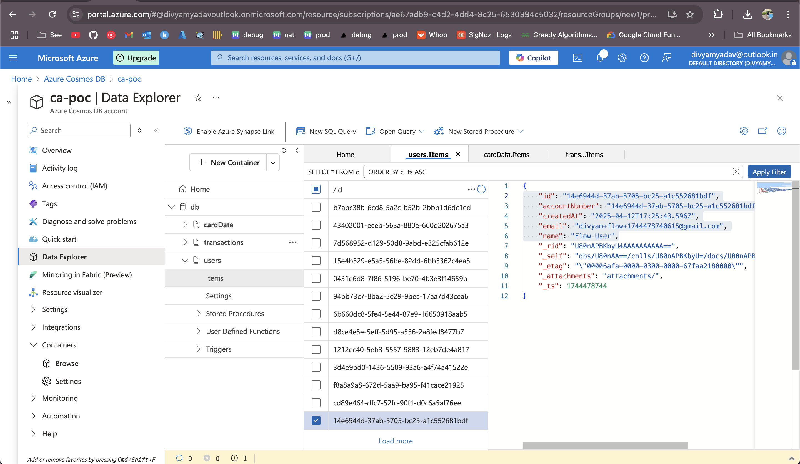
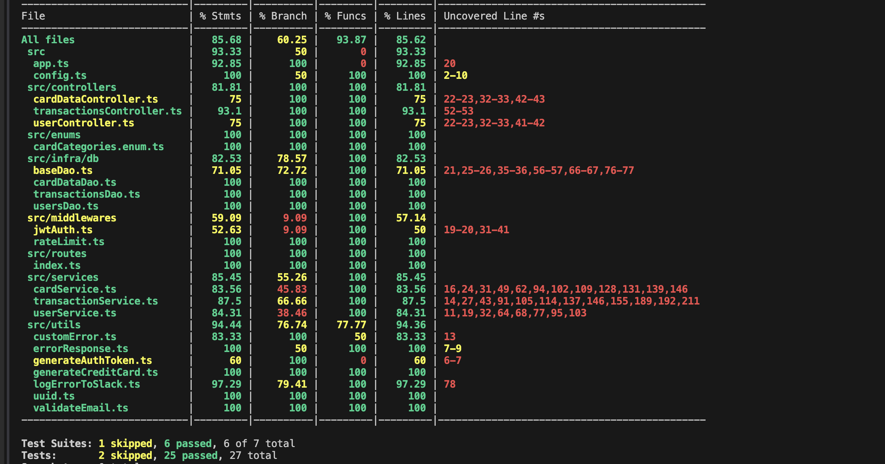
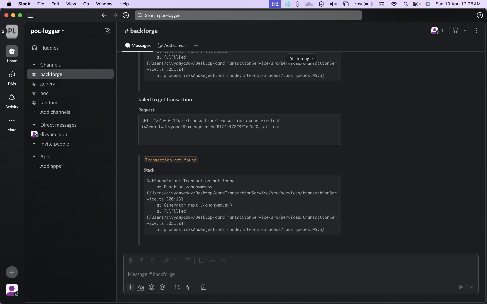

# Card-Transaction-Service
## 🚀 Getting Started

### 1. Clone the repository

```bash
git clone https://github.com/Lameboredghini/Card-Transaction-Service

cd Card-Transaction-Service

npm i
```

### 2. Setup environment
Create a .env file in the root directory:
sample

```bash
COSMOS_CONNECTION_STRING = 'COSMOS_CONNECTION_STRING'
COSMOS_DATABASE = 'db'
UUID_NAMESPACE = 'UUID_NAMESPACE'
JWT_PRIVATE_KEY = 'JWT_PRIVATE_KEY'
SLACK_HOOK = 'SLACK_HOOK'
```

### 3. run server
```
npm run dev
```
App will be available at: http://localhost:3000


## 🗃️ Database Architecture

This service uses **Azure Cosmos DB** with a partitioned, document-oriented schema. It ensures optimized query performance by setting partition keys and leveraging UUID v5-based unique identifiers.

---

### 🔐 UUID Strategy

All document `id` fields are generated using `UUID v5(email)`, leveraging the uniqueness of email addresses to create deterministic and human-linked identifiers for users and their related resources. This supports:

- Consistent lookup and filtering
- Index efficiency
- Improved horizontal scalability in CosmosDB

---

### ⚙️ Partition Keys

| Collection     | Partition Key | Notes                                    |
|----------------|----------------|------------------------------------------|
| `users`        | `id`           | User's UUID (v5 of email)                |
| `cards`        | `userId`       | Foreign key to `users.id`               |
| `transactions` | `userId`       | Foreign key to `users.id`               |

Partitioning by `userId` ensures strong affinity across a user’s resources and efficient querying per user.

---

### 👤 `users` Collection

| Field           | Type     | Description                         |
|----------------|----------|-------------------------------------|
| `id`           | UUID     | v5 UUID based on `email` (PK)       |
| `accountNumber`| UUID     | Same as `id`, used for banking logic|
| `email`        | String   | Unique user email                   |
| `name`         | String   | Full name                           |
| `createdAt`    | Date     | User creation timestamp             |

---

### 💳 `cards` Collection

| Field            | Type     | Description                           |
|------------------|----------|---------------------------------------|
| `id`             | UUID     | Card ID (same as `cardId`)            |
| `userId`         | UUID     | FK to `users.id`                      |
| `cardId`         | UUID     | FK to `cards.id`                      |
| `accountNumber`  | UUID     | FK to `users.accountNumber`           |
| `cardHolderName` | String   | Name on card                          |
| `cardNumber`     | String   | Masked 16-digit card number           |
| `cardType`       | String   | e.g., `GOLD`, `PLATINUM`              |
| `cardCategory`   | String   | e.g., `VISA`, `MASTERCARD`            |
| `limit`          | Number   | Total allowed spend                   |
| `expirationDate` | String   | Format: `YYYY/MM`                     |
| `cvv`            | String   | Encrypted/stored securely             |
| `createdAt`      | Date     | Creation timestamp                    |

> ✅ Partition Key: `userId`

---

### 💰 `transactions` Collection

| Field             | Type     | Description                             |
|-------------------|----------|-----------------------------------------|
| `id`              | UUID     | Unique transaction ID                   |
| `userId`          | UUID     | FK to `users.id`                        |
| `cardId`          | UUID     | FK to `cards.id`                        |
| `transactionType` | String   | `credit` or `debit`                     |
| `amount`          | Number   | Transaction amount                      |
| `updatedBalance`  | Number   | Balance post-transaction                |
| `status`          | String   | `pending`, `approved`, `refunded`, etc. |
| `createdAt`       | Date     | Transaction creation time               |
| `updatedOn`       | Date     | Last update timestamp                   |
| `deleted`         | Boolean  | Soft delete flag                        |

> ✅ Partition Key: `userId`


azure cosmos db


---


## 🔐 Authentication

All endpoints require a custom header:

```
x-user-id: <jwt encoded token> // for testing we can use 'divyam' as x-user-id in header
```

ex: header
```
x-user-id: divyam
```
This acts as the currently logged-in user's identifier.


## 📑 API Documentation

All routes are prefixed with /api

### 1. Create User

- URL: /api/users/create
- Method: POST
- Headers:
  - x-user-id: string (required)
- Body:

```json
{
  "email": "user@example.com",
  "name": "User Name"
}
```

- Response: 200 OK

```json
{
  "message": "User created successfully"
}
```

---

### 2. Create Card

- URL: /api/cards/create
- Method: POST
- Headers:
  - x-user-id: string (required)
- Body:

```json
{
  "email": "user@example.com",
  "expirationDate": "2099-12-31",
  "cardLimit": 2000,
  "cardCategory": "VISA"
}
```

- Response: 200 OK

```json
{
  "properties": {
    "id": "card-id"
  }
}
```

---

### 3. Create Transaction

- URL: /api/transactions/create
- Method: POST
- Headers:
  - x-user-id: string (required)
- Body:

```json
{
  "email": "user@example.com",
  "cardId": "card-id",
  "transactionType": "debit | credit",
  "amount": 100
}
```

- Response:

200 OK:

```json
{
  "transactionId": "txn-id"
}
```

400 Bad Request:

```json
{
  "message": "Insufficient balance"
}
```

---

### 4. Update Transaction Status

- URL: /api/transactions/update
- Method: POST
- Headers:
  - x-user-id: string (required)
- Body:

```json
{
  "email": "user@example.com",
  "transactionId": "txn-id",
  "status": "pending | approved | refunded"
}
```

- Response: 200 OK

```json
{
  "transactionId": "txn-id"
}
```

---

### 5. Delete Pending Transaction

- URL: /api/transactions/delete
- Method: POST
- Headers:
  - x-user-id: string (required)
- Body:

```json
{
  "email": "user@example.com",
  "transactionId": "txn-id"
}
```

- Response: 200 OK

```json
{
  "message": "Transaction deleted"
}
```

400 Bad Request:

```json
{
  "message": "Transaction is not pending"
}
```

---

### 6. Get All Transactions

- URL: /api/transactions/list
- Method: POST
- Headers:
  - x-user-id: string (required)
- Body:

```json
{
  "email": "user@example.com"
}
```

- Response: 200 OK

```json
[
  {
    "id": "txn-id",
    "cardId": "card-id",
    "amount": 100,
    "transactionType": "debit",
    "status": "pending"
  }
]
```

---

## 🧪 Testing

Run integration tests using:

```bash
npm run test
```

Tests cover:

- Transaction balance logic
- Valid status transitions
- Deletion rules
- End-to-end user/card/transaction flow



---


## 📝 Logging

For logging and monitoring purposes, errors are sent to Slack.



## ⚙️ Brief on Design Choices and Tradeoffs

- **Database**: Used **Azure Cosmos DB** for scalable and globally distributed database support.
- **Partitioning**: Implemented proper partitioning using `uuidv5` for efficient lookups and direct index fetching. All transaction IDs use UUID for uniqueness.
- **TypeScript Standards**: Adopted **TypeScript** with:
  - Enums
  - Controllers
  - Interfaces
  - Modular architecture
- **Cyclic Dependency Prevention**: Utilized **Madge** to detect and prevent cyclic dependencies.
- **Unique Card Generation**: Added a function to **generate unique credit card numbers**, ensuring no duplication occurs.
- **Testing**: Achieved high test coverage with:
  - Unit tests using **Jest**
  - One full **integration test**
- **Error Handling**:
  - All error responses follow a **consistent structure**
  - Integrated **Slack logging** for error tracking and easier debugging
- **Code Quality**:
  - Maintained using **ESLint** and **Prettier**
  - Consistent **camelCase naming** for variables and functions
- **Security & Performance**:
  - **JWT authentication middleware** for secure endpoints
  - **Rate limiter** to prevent abuse and DDoS attacks
- ** Secure Secrets Management**:  
  Used `.env` and environment-specific config files to manage sensitive credentials securely.


## 👨‍💻 Author
Made with coffee by @Lameboredghini